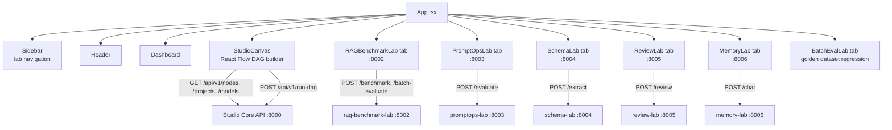

# 🖥️ LLMOps Studio UI


The React frontend for [LLMOps Studio](../LLMOpsStudio/llmops-studio) — a drag-and-drop DAG canvas for building LLM evaluation pipelines, plus standalone tabs for each independent laboratory (RAG Benchmark, PromptOps, Schema, Review, Memory, Batch/Golden-Dataset Evaluation).

## What it does

- **Studio Canvas** — build evaluation DAGs visually with [React Flow](https://reactflow.dev/): drag node types onto the canvas, wire outputs to inputs, configure each node from a schema-driven side panel, and run the whole graph against the Studio Core API.
- **Standalone lab tabs** — each laboratory also has a dedicated tab that talks directly to its own microservice, for quick one-off tests without building a full DAG.
- **Live model discovery** — model pickers (both in the DAG node config panel and in lab tabs) are populated from `GET /api/v1/models`, which proxies whatever is actually pulled into the local Ollama instance, instead of a hardcoded list.
- **Golden-dataset batch evaluation** — upload a JSON dataset, run it against the RAG pipeline, and get strict-accuracy / format-penalty metrics with a one-click CSV export for downstream analysis (e.g. a thesis methodology section).

## Component Map



## Tech Stack

- **React 19 + TypeScript + Vite**
- **[React Flow](https://reactflow.dev/)** for the DAG canvas
- **Tailwind CSS** utility classes for styling (dark-mode aware)
- **axios** for API calls, **lucide-react** for icons

## Quick Start

**Docker (recommended, part of the full stack):**

```bash
cd ../LLMOpsPlatform/llmops-platform
docker compose up --build
```

The UI is served by nginx on `http://localhost:5173`.

**Native development:**

```bash
npm install
npm run dev
```

By default the dev server runs on port 3000 (see `vite.config.ts` / `package.json`); the Studio Core API is expected at `http://localhost:8000` (see `VITE_API_BASE_URL` handling in `src/lib/api.ts`) and each lab's own port as listed in the component map above. Make sure the backend services are running first — see the [platform README](../LLMOpsPlatform/llmops-platform/README.md).

## Project Structure

```
src/
├── components/
│   ├── layout/        # Header, Sidebar
│   ├── labs/           # One component per standalone lab tab + Dashboard
│   └── studio/          # StudioCanvas — the DAG builder
├── lib/
│   ├── api.ts           # Studio Core API client
│   └── utils.ts
├── App.tsx
└── main.tsx
```

## Known Limitations

- No automated test suite yet (component tests are on the roadmap).
- Lab tab base URLs are hardcoded to `localhost:<port>` rather than being environment-configurable — fine for local/Docker Compose use, but would need to change for a remote deployment.
